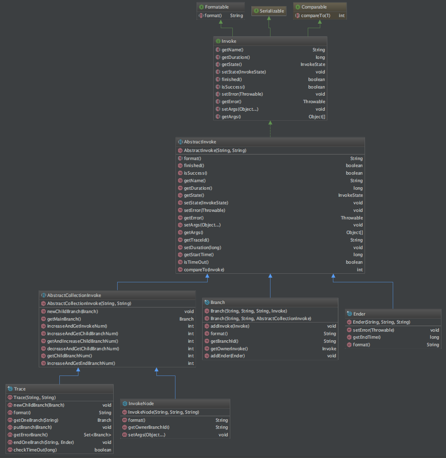
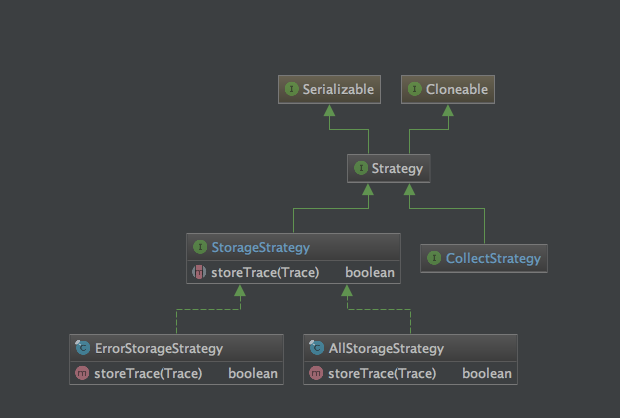
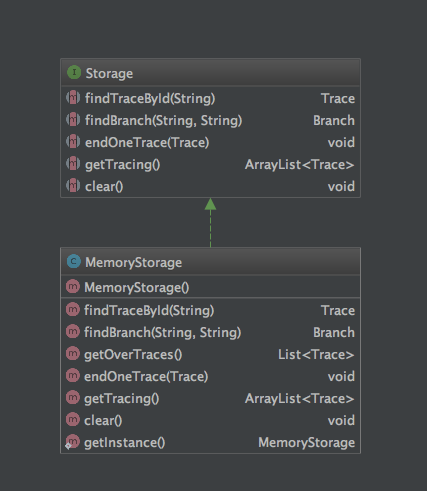
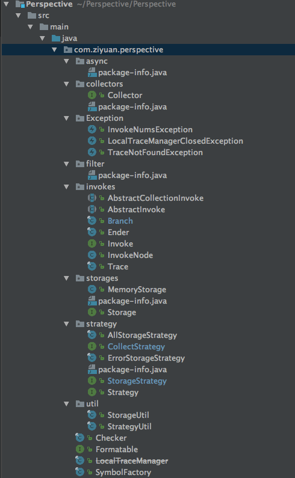
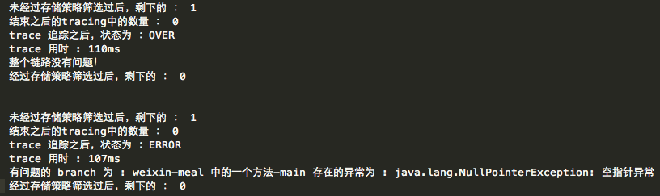
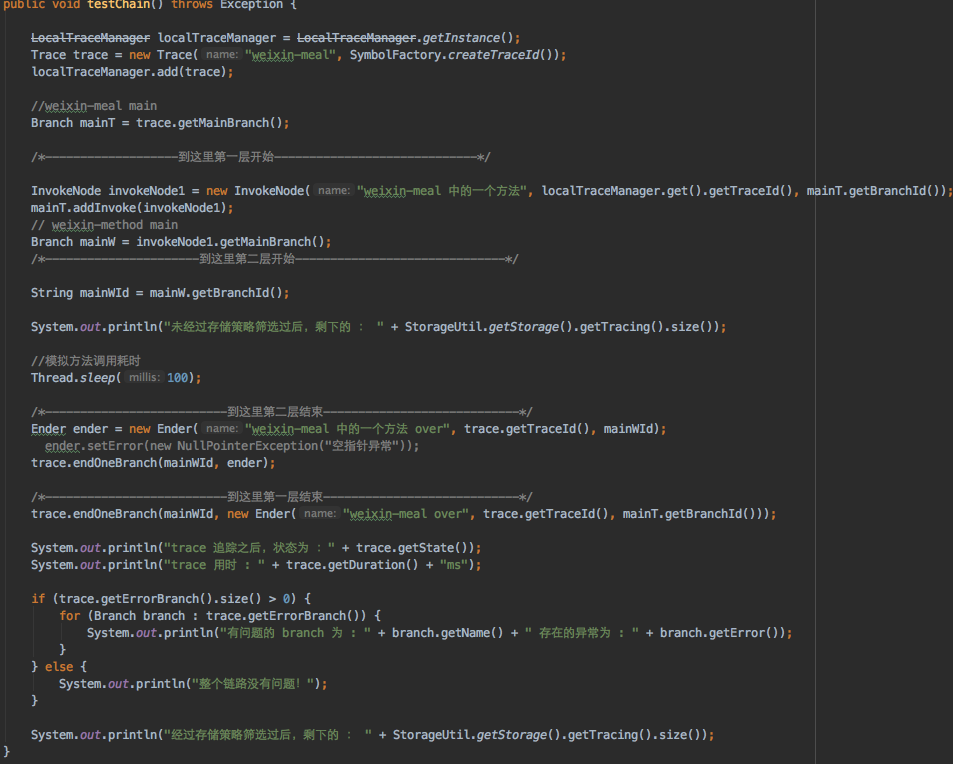
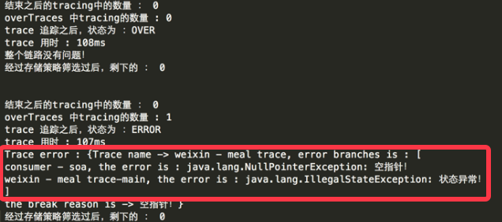
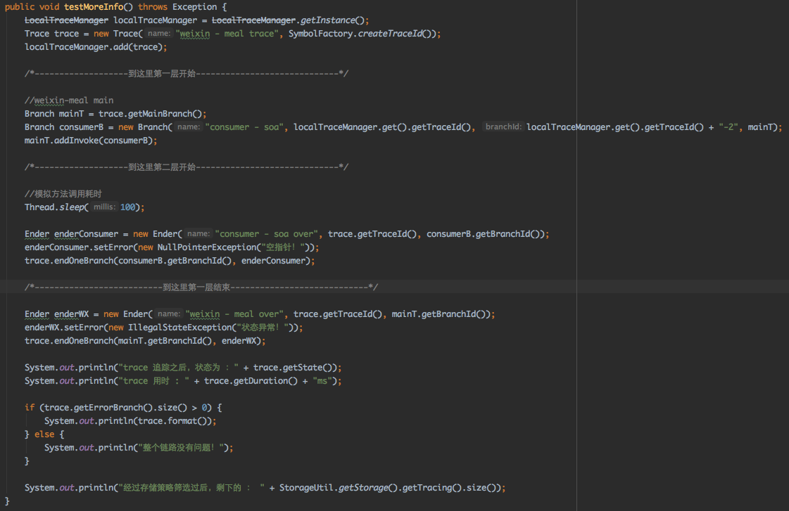
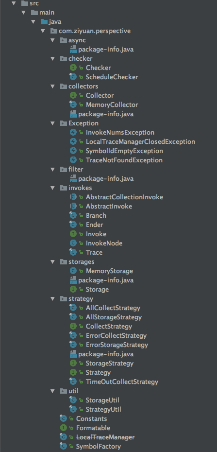
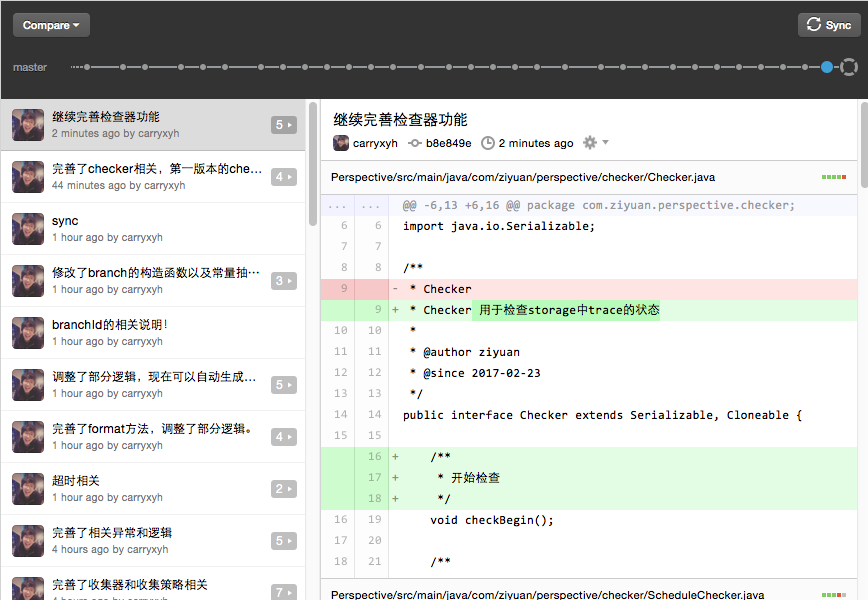

## Perspective -- 全链路监控系统
--------

**解决的问题**：最初版本，只解决购物车以下的链路监控。后面考虑适用在二维火其他系统。 

**相比于CAT、ZIPKIN**：更加轻量级。 

**处理异步线程的全局ID传递**：在进行线程操作的时候，使用统一提供的线程模型。包装一个线程类，创建之前从中央IDFactory中申请一个（没有则创建）全局ID，然后自己生成一个当前Branch的ID。线程池执行的其实只是一个代理类，finally中将全局ID和BranchID回传，用于绑定一个Trace和Branch。 

**进程间全局ID传递**：第一版本只针对Dubbo做扩展，使用类似CAT的方式，增加过滤器，同样把invoker.invoke包起来，finally中回传全局ID和BranchID 

**信息收集**：策略模式，暂定策略： 

1. Fetch：Collector从Storage中主动取回 
2. Receive：等待Storage主动来放入（这里设置一个阈值，比如Storage中Trace数量超过1000就放）。 
3. Higher：高吞吐的情况下使用的策略，结合以上两种一起使用。 

**信息存储**：同样策略模式，暂定策略： 

1. OnlyError：只存储失败的Trace。 
2. All：全部存储。 

------------

链路部分设计图： 

 

策略部分设计图： 

 

中央存储部分设计图： 

 

现阶段目录结构： 

 

-----------------

第一版本经过了最简单的测试环节，后面会模拟一个RPC调用，下面是测试的结果图： 

 

测试代码如下： 

 

这个版本调整了相应的逻辑，之前的逻辑： 
一个Trace中任何一个branch出现异常，直接从Storage中移除Trace，并且把该Trace放到有问题的Trace集合中。 

现在调整为： 
一个Trace中出现异常，会保存当前状态，但是等待后面的ender，什么时候ender数量和子branch数量相等，什么时候移除trace（逻辑同上），一直不结束的Trace（比如超时）会由checker去移除该Trace。 

-----------------

今天继续完善了Perspective的Checker和Storage，更改了目录结构，并且进行了新一轮的测试，问题比之前已经少了很多，完善了trace的信息打印，真正开始有点全链路监控的模样了，看图： 

 

测试代码： 

 

这里相比上一个测试还有点变化，这次使用的模型是branch嵌套branch的结构，没有添加节点。 

继上一次调整目录结构之后，这次又一次调整了目录结构： 

 

眼看着一个屏幕已经装不下了，哇，说不出来的欣慰。今天顺便看了一下git的提交记录： 

 

从第一天开始设计、构思到写到现在已经过去了一个多周了，期待Perspective的诞生！ 